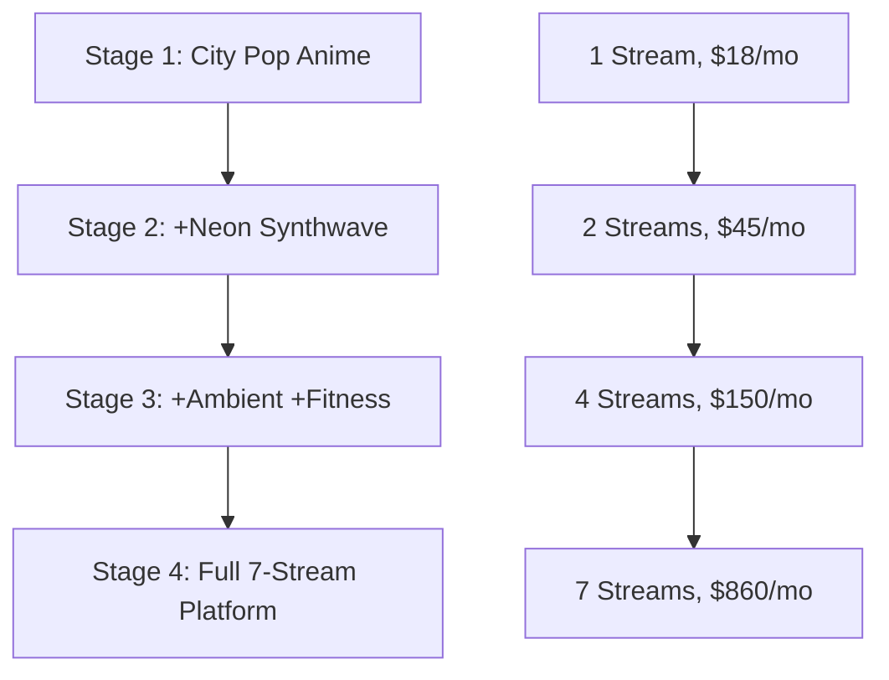

# 🎵 Interactive AI Music Streaming Platform

> **Transform from $18/month side project to $31k/month AI media empire**

The first truly interactive AI music streaming platform where viewers co-create content in real-time through chat commands, voting, and contextual AI that responds to weather, time, and community mood.

[-blue)](BOOTSTRAP_PLAN.md)
[](MULTI_STREAM_ARCHITECTURE.md)
[](CLAUDE.md)
[](DEPLOYMENT_COMMANDS.md)

## 🚀 Quick Start

### Prerequisites
- Contabo VPS (€4.02/month)
- YouTube Data API key
- YouTube Live stream key  
- Suno.ai API key (configured: `b4ec4a1698ed35aeaa76280d62fb8c77`)

### Deploy in 3 Commands
```bash
# 1. Clone and setup
git clone https://github.com/ghlarsen/StreamsForLovers.git
cd StreamsForLovers

# 2. Deploy to server
./deploy.sh

# 3. Monitor deployment
ssh root@161.97.116.47 'journalctl -u ai-music-stream -f'
```

## 🏗️ Architecture Overview

### Current: Stage 1 (City Pop Anime)
- **Cost**: $18/month
- **Target**: 1,000+ viewers, $300-900/month revenue
- **Infrastructure**: Single Contabo VPS + AI APIs

### Planned: Stage 4 (Full Platform)
- **Cost**: $860/month  
- **Target**: 15,000+ viewers, $8,500-31,400/month revenue
- **Infrastructure**: 8 servers + enterprise features



## 🎮 Interactive Features

### Chat Commands
```
!generate jazz rainy day    # Generate specific music style
!mood upbeat study          # Set mood-based generation  
!theme halloween spooky     # Request themed content
!vote A                     # Vote in community polls
```

### Automated Intelligence
- **Time-responsive**: Morning energy → evening chill
- **Weather-responsive**: Real weather affects music mood  
- **Viewer-responsive**: More viewers → more energetic music
- **Seasonal**: Holiday themes, seasonal changes

## 📊 Stream Portfolio (Full Platform)

| Stream | Genre | Visual Theme | Target Audience | Revenue Potential |
|--------|-------|--------------|-----------------|-------------------|
| **City Pop Anime** | Lo-fi/City Pop | Anime aesthetics | Study/chill | $1,500-4,500/mo |
| **Neon Synthwave** | Synthwave/Electronic | Cyberpunk/80s | Gaming/retro | $1,200-3,600/mo |
| **Cosmic Ambient** | Ambient/Drone | Space/Nature | Meditation/sleep | $1,800-6,000/mo |
| **Fitness Beats** | Electronic/Hip-Hop | Workout visuals | Fitness enthusiasts | $900-3,000/mo |
| **Noir Jazz** | Jazz/Blues | Film Noir | Sophisticated listeners | $600-1,800/mo |
| **Desert Country** | Country/Western | Desert landscapes | Country music fans | $900-2,400/mo |
| **Intimate Vibes** | R&B/Ambient | Soft lighting | Couples/romantic | $600-2,100/mo |

## 💰 Financial Model

### Bootstrap Scaling (Revenue-Driven)
```
Stage 1: $18/mo cost → $300-900/mo revenue    = 17-50x ROI
Stage 2: $45/mo cost → $600-1,800/mo revenue  = 13-40x ROI  
Stage 3: $150/mo cost → $2,000-6,000/mo revenue = 13-40x ROI
Stage 4: $860/mo cost → $8,500-31,400/mo revenue = 10-36x ROI
```

### Exit Criteria (Must Meet Before Scaling)
- **Stage 1→2**: $200+ monthly profit
- **Stage 2→3**: $1,000+ monthly revenue
- **Stage 3→4**: $3,000+ monthly revenue

## 🛠️ Technology Stack

### Core Infrastructure
- **Servers**: Contabo VPS cluster
- **Streaming**: YouTube Live RTMP
- **Orchestration**: Python asyncio + systemd
- **Monitoring**: Health checks + emergency failover

### AI Content Generation
- **Music**: Suno.ai API (~$0.01/song)
- **Video**: MiniMax Hailuo API ($95/month unlimited)
- **Chat**: YouTube Data API + sentiment analysis
- **Prompts**: Contextual AI prompt generation

### Development & Deployment
- **Version Control**: GitHub with auto-deployment
- **Server Management**: Contabo CLI + automation scripts
- **Monitoring**: Real-time health checks + Discord alerts

## 📁 Project Structure

```
StreamsForLovers/
├── README.md              # This file
├── CLAUDE.md              # Claude Code configuration
├── PROJECT_PLAN.md        # Master project roadmap
├── BOOTSTRAP_PLAN.md      # Scaling strategy
├── LAUNCH_CHECKLIST.md    # Go-live procedures
├── 
├── src/                   # Core application code
│   ├── main.py           # Main orchestration system
│   ├── suno_api_client.py # Music generation
│   ├── background_generator.py # Video generation
│   ├── chat_bot.py       # YouTube chat monitoring
│   ├── queue_manager.py  # Content scheduling
│   └── obs_controller.py # OBS automation
├──
├── scripts/               # Server management scripts
│   ├── deploy.sh         # Simple deployment
│   ├── setup_server.sh   # Initial server setup
│   ├── safe_reboot.sh    # Graceful restart
│   ├── emergency_mode.sh # Disaster recovery
│   └── contabo_management.sh # Multi-server provisioning
├──
├── config/                # Configuration files
│   ├── .env.example     # Template configuration
│   └── .env             # Production config (gitignored)
└──
└── requirements.txt       # Python dependencies
```

## 🚀 Getting Started

### 1. Server Setup
```bash
# Connect to your Contabo VPS
ssh root@161.97.116.47

# Run automated setup
chmod +x setup_server.sh && ./setup_server.sh
```

### 2. Configuration
```bash
# Copy environment template
cp config/.env.example config/.env

# Add your API keys
nano config/.env
```

### 3. Launch
```bash
# Deploy latest code
./deploy.sh

# Start streaming service
systemctl start ai-music-stream

# Monitor live logs
journalctl -u ai-music-stream -f
```

## 📈 Success Metrics

### Stage 1 KPIs
- **👥 Viewers**: 500+ concurrent consistently
- **💬 Engagement**: 50+ chat interactions/hour  
- **⏱️ Uptime**: >95% stream availability
- **💰 Costs**: <$18/month operational
- **🎵 Content**: 360+ unique songs/month

### Business Growth Tracking
- **Monthly Recurring Revenue**: Growth trajectory
- **Cost Per Viewer**: Efficiency optimization  
- **Content Uniqueness**: AI-generated catalog size
- **Community Engagement**: Subscriber & interaction growth

## 🔧 Management Commands

### Daily Operations
```bash
# Check system health
./scripts/health_check.sh

# View stream status  
systemctl status ai-music-stream

# Monitor real-time logs
journalctl -u ai-music-stream -f
```

### Emergency Procedures
```bash
# Activate emergency mode
./scripts/emergency_mode.sh --reason "manual_trigger"

# Safe server reboot
./scripts/safe_reboot.sh  

# Check API usage/costs
python3 -c "from src.suno_api_client import SunoAPIClient; print(SunoAPIClient().get_usage_stats())"
```

### Scaling Operations
```bash
# Provision Stage 2 infrastructure
./scripts/contabo_management.sh provision-stage-2

# Calculate current costs
./scripts/contabo_management.sh costs

# Start/stop servers by stage
./scripts/contabo_management.sh stop 2
./scripts/contabo_management.sh start 2
```

## 🎯 Unique Value Proposition

**"First truly interactive AI music stream where viewers co-create content in real-time"**

### Competitive Advantages
1. **🤖 Real-time AI Interaction** - Unprecedented viewer engagement
2. **🎭 Multi-Genre Diversification** - Risk mitigation across audiences  
3. **📈 Scalable Architecture** - Rapid expansion capability
4. **👥 Community-Driven Content** - Higher engagement than static streams
5. **🌐 Cross-Stream Synergies** - Audience network effects

## 📞 Support & Contact

- **Repository**: https://github.com/ghlarsen/StreamsForLovers.git
- **Server**: 161.97.116.47 (Contabo VPS)
- **Documentation**: See `/docs/` folder for detailed guides
- **Emergency**: Check `scripts/emergency_mode.sh` logs

## 📄 License

MIT License - See LICENSE file for details

---

**🎵 Ready to build the future of interactive music streaming? Let's make it happen!** 🚀

*Last Updated: 2025-09-13*  
*Current Stage: 1 (City Pop Anime MVP)*  
*Next Milestone: 500+ concurrent viewers, $200+ monthly profit*